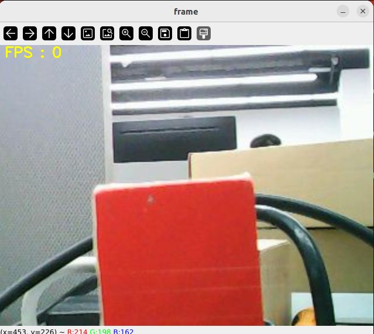
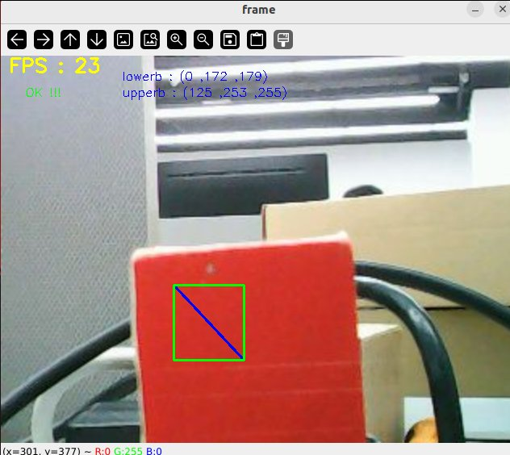
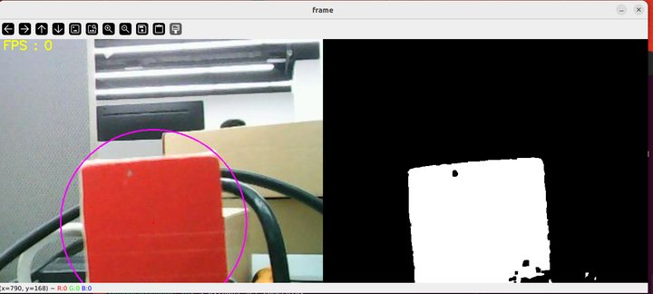
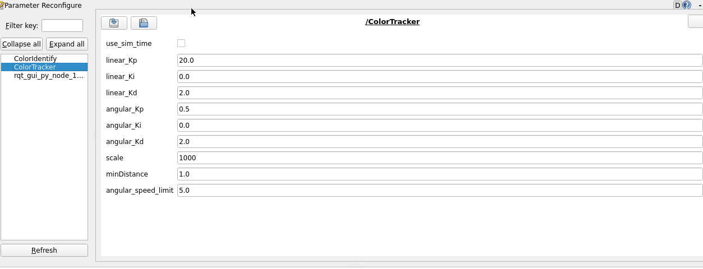

## 颜色追踪

注：虚拟机、ROS-wifi图传模块需要与microROS控制板ROS_DOMAIN_ID需要一致，都要设置成20，可以查看【MicroROS控制板参数配置】来设置microROS控制板ROS_DOMAIN_ID，查看教程【连接MicroROS代理】判断ID是否一致。

**运行实验前请确保microros小车和ROS-wifi图传模块在虚拟机(linux带有humbleROS2系统)上正确开启了代理**

### 1、程序功能说明

MicroROS机器人颜色追踪，具备可以随时识别多种颜色，并自主储存当前识别的颜色，控制小车云台追随检测识别的颜色。

MicroROS机器人的颜色追踪还可以实现HSV实时调控的功能，通过调节HSV的高低阈值，过滤掉干扰的颜色，使得方块在复杂的环境中能够非常理想的被识别出来，如果在取色中效果不理想的话，这个时候需要将小车移动到不同环境下校准一下，以达到可以在复杂环境中，识别我们所需的颜色。

### 2、程序代码参考路径

```
~/yahboomcar_ws/src/yahboom_esp32ai_car/yahboom_esp32ai_car/colorHSV.py
~/yahboomcar_ws/src/yahboom_esp32ai_car/yahboom_esp32ai_car/colorTracker.py
```

- colorHSV.py

  主要是完成图像处理，计算出被追踪物体的中心坐标。

- colorTracker.py

  主要是根据被追踪物体的中心坐标和深度信息，计算出舵机运动角度数据给底盘。

### 3、程序启动

#### 3.1、启动命令

 终端输入，

```py
#启动舵机校准程序
#当舵机的角度不处于中间的时候，需要执行以下命令
ros2 run yahboom_esp32_mediapipe control_servo 

# 舵机运动后，舵机还是不处于中间，需要手动重新安装云台，可以不断电操作，让舵机处于一个锁住状态，方便调整
```
**舵机处于中间后，要按"Ctrl+C"终止程序，避免影响接下来的实验操作**


```PY
#启动颜色追踪程序
ros2 run yahboom_esp32ai_car colorHSV
ros2 run yahboom_esp32ai_car colorTracker
```
**如果摄像头的画面图像出现倒置**，需要看到**3.摄像头画面纠正(必看)**文档自己纠正，该实验不再阐述。


以追踪红色为例，程序启动后，会出现以下画面，



然后按下键盘上的r/R键进入选色模式，用鼠标框出一片区域（该区域只能有一中颜色），



选完后，效果如下图，



然后，按下空格键进入追踪模式，缓慢移动物体，能看到机器人云台会追踪色块运动。

#### 3.2、动态参数调节

Docker终端输入，

```
ros2 run rqt_reconfigure rqt_reconfigure
```



修改完参数，点击GUI空白处写入参数值。由上图可知，

- colorTracker主要调节PID三个参数来让云台更灵敏。

### 4、核心代码

#### 4.1、colorHSV.py

这个程序主要有以下几个功能：

- 打开摄像头，获取图像；
- 获取键盘鼠标事件，用于切换模式和取色；
- 处理图像以及发布追踪物体的中心坐标并且发布出去。

部分核心代码如下，

```py
#创建发布者，发布追踪物体的中心坐标
self.pub_position = self.create_publisher(Position,"/Current_point", 10)
#获取键盘鼠标事件，得到hsv的值；
 if action == 32: self.Track_state = 'tracking'
        elif action == ord('i') or action == ord('I'): self.Track_state = "identify"
        elif action == ord('r') or action == ord('R'): self.Reset()
        elif action == ord('q') or action == ord('Q'): self.cancel()
        if self.Track_state == 'init':
            cv.namedWindow(self.windows_name, cv.WINDOW_AUTOSIZE)
            cv.setMouseCallback(self.windows_name, self.onMouse, 0)
            if self.select_flags == True:
                cv.line(rgb_img, self.cols, self.rows, (255, 0, 0), 2)
                cv.rectangle(rgb_img, self.cols, self.rows, (0, 255, 0), 2)
                if self.Roi_init[0] != self.Roi_init[2] and self.Roi_init[1] != self.Roi_init[3]:
                    rgb_img, self.hsv_range = self.color.Roi_hsv(rgb_img, self.Roi_init)
                    self.gTracker_state = True
                    self.dyn_update = True
                else: self.Track_state = 'init'
#计算中心坐标的值，self.circle存放xy值
rgb_img, binary, self.circle = self.color.object_follow(rgb_img, self.hsv_range)
#发布中心坐标的消息
threading.Thread(target=self.execute, args=(self.circle[0], self.circle[1], self.circle[2])).start()
def execute(self, x, y, z):
    position = Position()
    position.anglex = x * 1.0
    position.angley = y * 1.0
    position.distance = z * 1.0
    self.pub_position.publish(position)
```

#### 4.2、colorTracker.py

这个程序主要有以下几个功能：接收/Current_point和深度图像话题数据，计算速度大小，然后发布速度数据。

部分代码如下，

```py
#定义订阅者接收需要的话题数据
self.sub_depth = self.create_subscription(Image,"/image_raw", self.depth_img_Callback, 1)
self.sub_JoyState =self.create_subscription(Bool,'/JoyState',self.JoyStateCallback,1)
self.sub_position =self.create_subscription(Position,"/Current_point",self.positionCallback,1)
#定义速度发布者
self.pub_cmdVel = self.create_publisher(Twist,'/cmd_vel',10)
self.pub_Servo1 = self.create_publisher(Int32,"servo_s1" , 10)
self.pub_Servo2 = self.create_publisher(Int32,"servo_s2" , 10)

#两个重要的回调函数，获取到self.Center_x值和distance_值
def positionCallback(self, msg):
def depth_img_Callback(self, msg):
#self.Center_x值和distance_值根据计算线速度，角速度
self.execute(self.Center_x, distance_)
 def execute(self, point_x, point_y):
        [x_Pid, y_Pid] = self.linear_pid .update([point_x - 320, point_y - 240])
        if self.img_flip == True:
            self.PWMServo_X += x_Pid
            self.PWMServo_Y += y_Pid
        else:
            self.PWMServo_X  -= x_Pid
            self.PWMServo_Y  += y_Pid

        if self.PWMServo_X  >= 45:
            self.PWMServo_X  = 45
        elif self.PWMServo_X  <= -45:
            self.PWMServo_X  = -45
        if self.PWMServo_Y >= 40:
            self.PWMServo_Y = 40
        elif self.PWMServo_Y <= -90:
            self.PWMServo_Y = -90

        # rospy.loginfo("target_servox: {}, target_servoy: {}".format(self.target_servox, self.target_servoy))
        print("servo1",self.PWMServo_X)
        servo1_angle = Int32()
        servo1_angle.data = int(self.PWMServo_X)
        servo2_angle = Int32()
        servo2_angle.data = int(self.PWMServo_Y)
        self.pub_Servo1.publish(servo1_angle)
        self.pub_Servo2.publish(servo2_angle)

```


