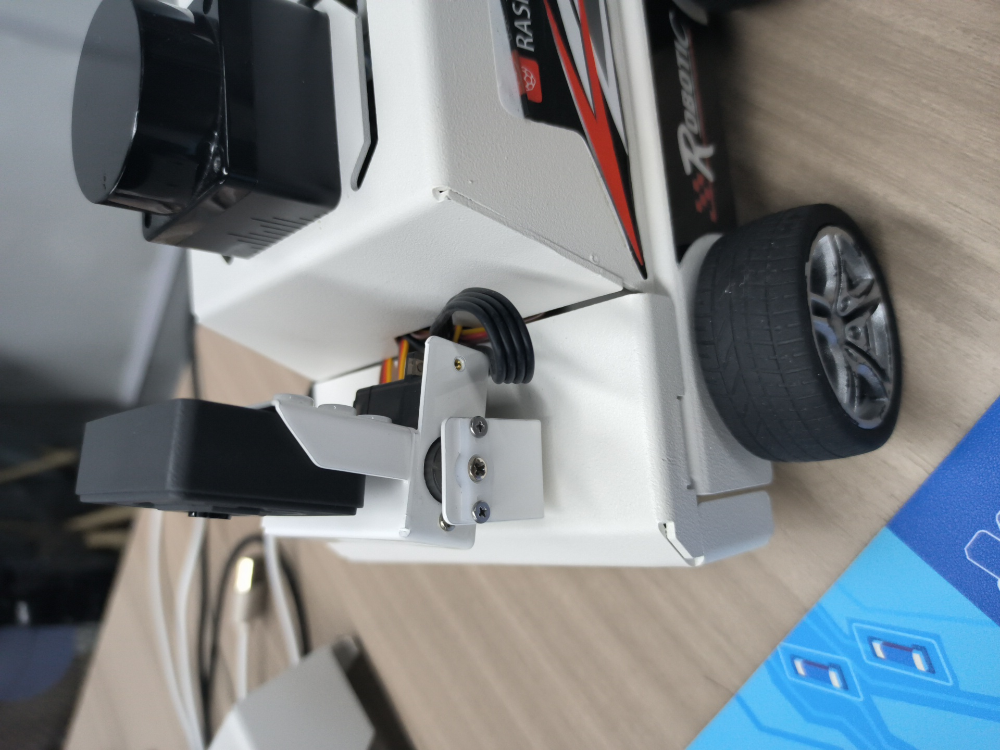
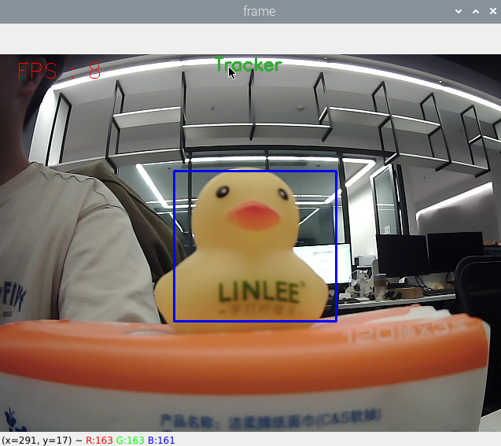
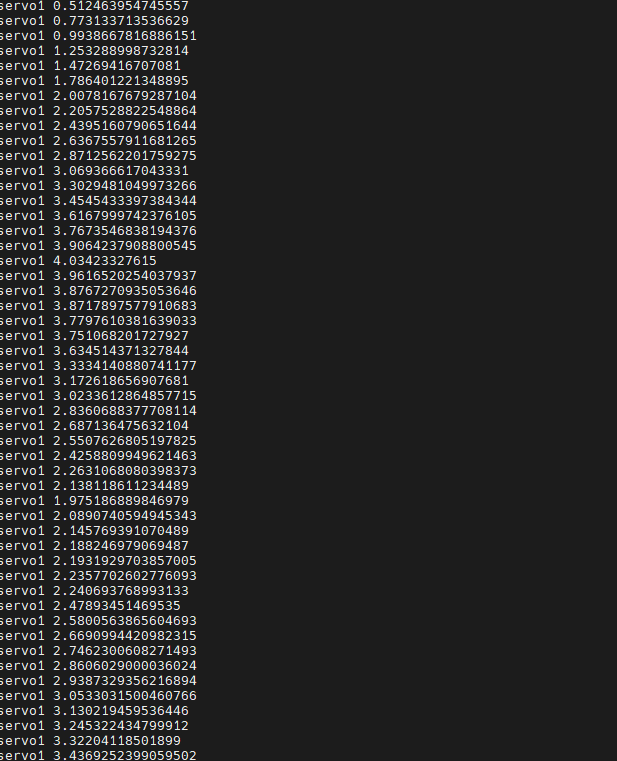
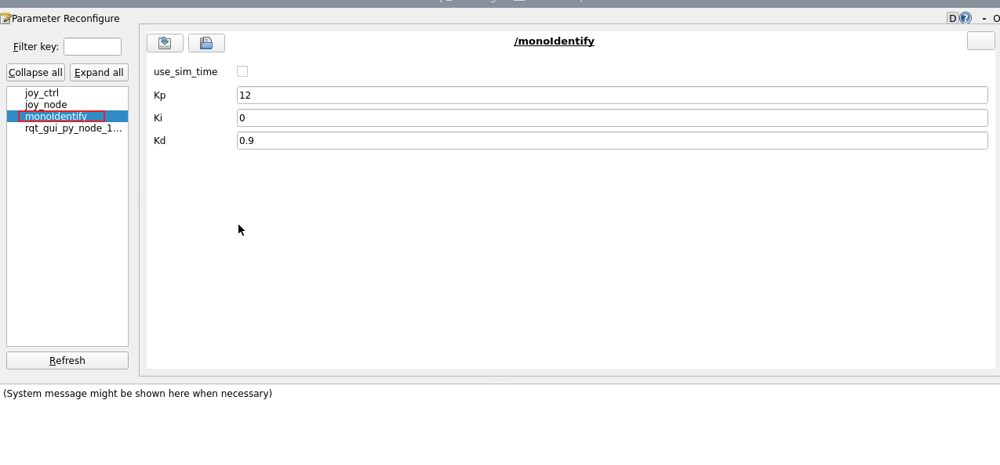
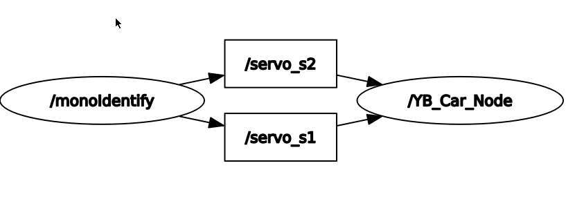

## 物体追踪

注：虚拟机、ROS-wifi图传模块需要与microROS控制板ROS_DOMAIN_ID需要一致，都要设置成20，可以查看【MicroROS控制板参数配置】来设置microROS控制板ROS_DOMAIN_ID，查看教程【连接MicroROS代理】判断ID是否一致。

### 1、程序功能说明

程序启动后，通过鼠标选中需要跟踪的物体，按下空格键，小车的云台舵机进入跟踪模式。小车云台会跟随 被跟踪的物体移动，并且时刻保证被追踪的物体保持在画面中心。

### 2、操作步骤

#### 2.1、启动

进入docker，终端输入，

```
ros2 run yahboom_esp32ai_car mono_Tracker
```
**如果摄像头的角度不是处于该角度，请按CTRL+C结束程序，重新运行一下，这是因为网络延迟导致发送舵机的角度丢包导致**




**如果摄像头的画面图像出现倒置**，需要看**3.摄像头画面纠正(必看)**文档自己纠正，该实验不再阐述。


#### 2.2、识别

启动之后，进入选择模式，用鼠标选中目标所在位置，如下图所示，松开即开始识别。



键盘按键控制：

【r】：选择模式，可用鼠标选择要识别目标的区域，如上图。

【q】：退出程序。

【空格键】：目标追踪；在跟随的时候缓慢移动目标即可，移动太快将会丢失目标。

按下空格能看到通过pid算出来的运动角度。



还可以使用动态参数调节器对PID参数进行调试，Docker终端输入，

```
ros2 run rqt_reconfigure rqt_reconfigure 
```



可调节的参数有小车云台的PID参数 ，修改参数后，点击“refresh”刷新数据。

#### 2.3、查看节点话题通讯图

可以通过以下命令查看节点之间的话题通讯，



### 3、核心代码

功能实现的原理与颜色追踪差不多，都是根据目标的中心坐标和来计算s1、s2舵机转动角度，然后发布给底盘，部分代码入下，

```py
#这部分是选择物体后，得出中心坐标，用于计算舵机角度
if len(contours) != 0:
    areas = []
    for c in range(len(contours)): areas.append(cv.contourArea(contours[c]))
    max_id = areas.index(max(areas))
    max_rect = cv.minAreaRect(contours[max_id])
    max_box = cv.boxPoints(max_rect)
    max_box = np.int0(max_box)
    (color_x, color_y), color_radius = cv.minEnclosingCircle(max_box)
#这部分是计算出center_x，distance的值，
center_x = targEnd_x / 2 + targBegin_x / 2
center_y = targEnd_y / 2 + targBegin_y / 2
width = targEnd_x - targBegin_x
high = targEnd_y - targBegin_y
self.point_pose = (center_x, center_y, min(width, high))
if self.Track_state == 'tracking':
   if self.circle[2] != 0: threading.Thread(target=self.execute, args=(self.circle[0], self.circle[1])).start()
#通过pid计算舵机运动角度
[x_Pid, y_Pid] = self.PID_controller.update([point_x - 320, point_y - 240])
   if self.img_flip == True:
        self.target_servox -= x_Pid
        self.target_servoy += y_Pid
   else:
        self.target_servox -= x_Pid
        self.target_servoy += y_Pid
   if self.target_servox >= 45:
     self.target_servox = 45
   elif self.target_servox <= -45:
     self.target_servox = -45
   if self.target_servoy >= 40:
     self.target_servoy = 40
   elif self.target_servoy <= -90:
     self.target_servoy = -90

```


