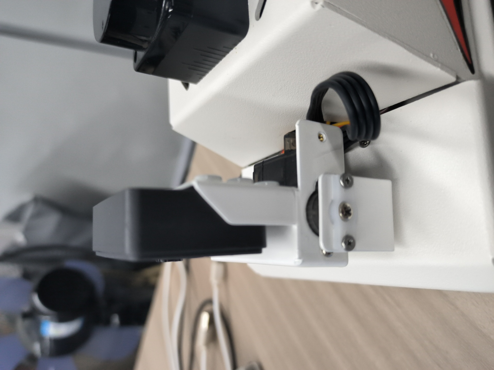

## 人脸识别追踪

注：虚拟机、ROS-wifi图传模块需要与microROS控制板ROS_DOMAIN_ID需要一致，都要设置成20，可以查看【MicroROS控制板参数配置】来设置microROS控制板ROS_DOMAIN_ID，查看教程【连接MicroROS代理】判断ID是否一致。

### 1、程序说明

运行程序后，当人脸展现在画面中时，当出现方框围住人脸时，云台摄像头会跟随人脸的移动而移动。

### 2、操作步骤

程序代码参考路径：

```
/home/yahboom/yahboomcar_ws/src/yahboom_esp32ai_car/yahboom_esp32ai_car/face_fllow.py
```

#### 2.1、启动命令

 根据实际的车型，终端输入

```
ros2 run yahboom_esp32ai_car face_fllow  
```
**如果摄像头的角度不是处于该角度，请按CTRL+C结束程序，重新运行一下，这是因为网络延迟导致发送舵机的角度丢包导致**


**如果摄像头的画面图像出现倒置**，需要看**3.摄像头画面纠正(必看)**文档自己纠正，该实验不再阐述。


程序启动后，会出现以下摄像头画面，


当识别人脸会框选，并且二维云台跟随人脸移动，并且终端打印移动角度


#### 2.2、动态参数调节

Docker终端输入，

```
ros2 run rqt_reconfigure rqt_reconfigure
```


修改完参数，点击GUI空白处写入参数值。由上图可知，

- faceTracker主要调节PID三个参数来让云台更灵敏

### 3、核心代码

#### 3.1、face_fllow .py

功能实现的原理与物体追踪差不多，都是根据目标的中心坐标计算舵机转动角度，然后发布给底盘，部分代码入下，

```py
#计算中心点
 cv.putText(frame, text, (20, 30), cv.FONT_HERSHEY_SIMPLEX, 0.9, (0, 0, 255), 1)
        face_patterns = cv2.CascadeClassifier('/home/yahboom/yahboomcar_ws/src/yahboom_esp32ai_car/yahboom_esp32ai_car/haarcascade_frontalface_default.xml')
        faces = face_patterns.detectMultiScale(frame , scaleFactor=1.1, minNeighbors=5, minSize=(100, 100))
        if len(faces)>0:
            for (x, y, w, h) in faces:
                m=x
                n=y
                cv2.rectangle(frame, (x, y), (x + w, y + h), (0, 255, 0), 2)
            self.execute(m,n)
#根据中心点，计算舵机转动
 [x_Pid, y_Pid] = self.PID_controller.update([point_x - 320, point_y - 240])
        if self.img_flip == True:
            self.PWMServo_X += x_Pid
            self.PWMServo_Y += y_Pid
        else:
            self.PWMServo_X  -= x_Pid
            self.PWMServo_Y  += y_Pid

        if self.PWMServo_X  >= 40:
            self.PWMServo_X  = 40
        elif self.PWMServo_X  <= -40:
            self.PWMServo_X  = -40
        if self.PWMServo_Y >= 40:
            self.PWMServo_Y = 40
        elif self.PWMServo_Y <= -90:
            self.PWMServo_Y = -90

```


