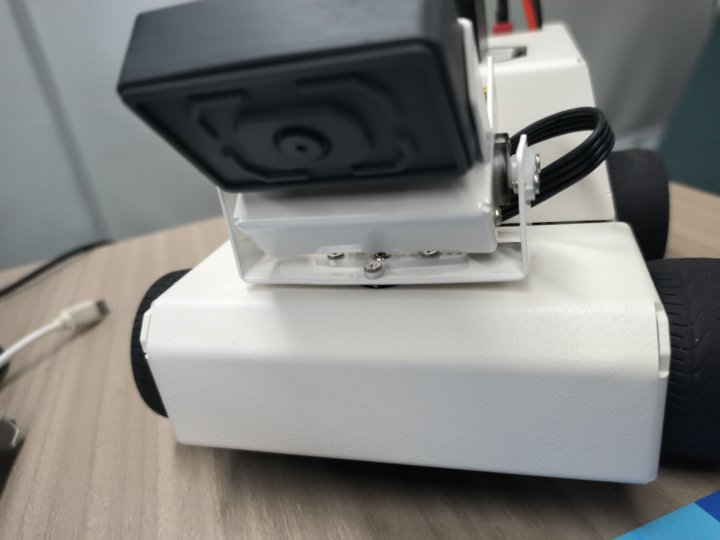
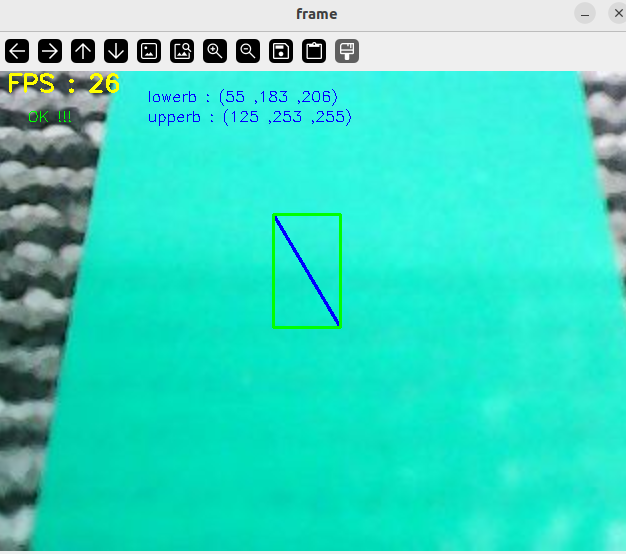
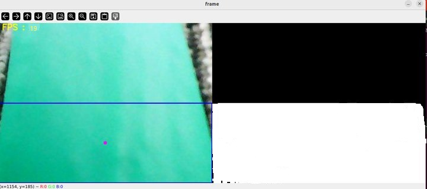
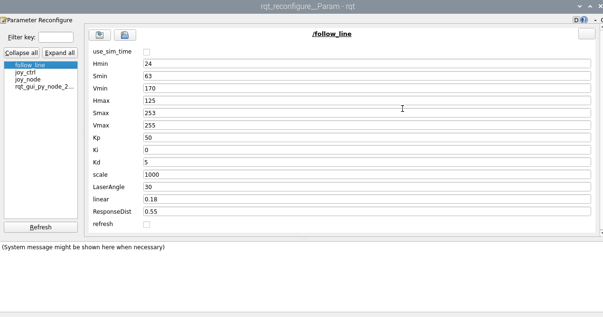

## 巡线自动驾驶

注：虚拟机、ROS-wifi图传模块需要与microROS控制板ROS_DOMAIN_ID需要一致，都要设置成20，可以查看【MicroROS控制板参数配置】来设置microROS控制板ROS_DOMAIN_ID，查看教程【连接MicroROS代理】判断ID是否一致。

### 1、程序功能说明

程序启动后，调整摄像头的俯仰角，把摄像头往下掰动，使得摄像头可以看到线，然后点击图像窗口，按下r键进选色模式；接着在在画面中的线的区域内，框出所需要巡线的颜色，松开鼠标后会自动加载处理后的图像；最后按下空格键开启巡线功能。小车在运行过程中，遇到障碍物会停下并且蜂鸣器会响。

### 2、程序代码参考路径

 该功能源码的位置位于，

```
/home/yahboom/yahboomcar_ws/src/yahboom_esp32ai_car/yahboom_esp32ai_car/follow_line.py
```

### 3、程序启动

#### 3.1、启动命令

 终端输入，

```
ros2 run yahboom_esp32ai_car follow_line 
```
**如果摄像头的角度不是处于该角度，请按CTRL+C结束程序，重新运行一下，这是因为网络延迟导致发送舵机的角度丢包导致**


**如果摄像头的画面图像出现倒置**，需要看**3.摄像头画面纠正(必看)**文档自己纠正，该实验不再阐述。

以巡绿线为例，



按下r键后，如上图选择蓝线区域，选定后松开鼠标，



如上图所示，右边显示的就是处理后的图像，它会显示绿线部分。**因为摄像头的像素才200W，尽可能的把线放到图像中间**，然后再按下空格键则开始计算速度，小车巡线自动驾驶。

#### 3.2、动态参数调节

可以通过动态参数器可以调节相关参数，docker终端输入，

```
ros2 run rqt_reconfigure rqt_reconfigure
```



可调节的参数有，

|     参数     |      说明       |
| :----------: | :-------------: |
|      Kp      |    PID的P值     |
|      Ki      |    PID的I值     |
|      Kd      |    PID的D值     |
|    scale     | PID调节比例系数 |
|  LaserAngle  | 雷达检测的角度  |
|    linear    |   线速度大小    |
| ResponseDist |  避障检测距离   |
|   refresh    |  刷新参数按钮   |

### 4、核心代码

我们先梳理下巡线的实现原理，通过

- 计算巡线的中心坐标与图像中心的偏移量，
- 根据坐标偏移量计算出角速度的值，
- 发布速度驱动小车。

计算中心坐标，

```py
#计算hsv值
rgb_img, self.hsv_range = self.color.Roi_hsv(rgb_img, self.Roi_init)
#计算self.circle，计算出X的坐标、半径值。半径值为0说明没有检测到线，则发布停车信息
rgb_img, binary, self.circle = self.color.line_follow(rgb_img, self.hsv_range)
```

计算出角速度的值，

```py
#320是中心点的X坐标的值，通过得到的图像的X值与320的偏差，可以计算出“我现在距离中心有多远”，然后计算角速度的值
[z_Pid, _] = self.PID_controller.update([(point_x - 320)*1.0/16, 0])
```

 


