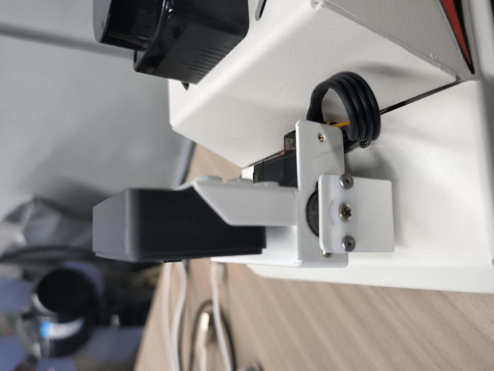
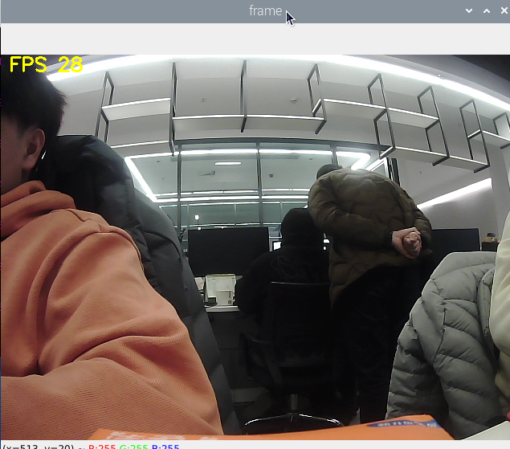
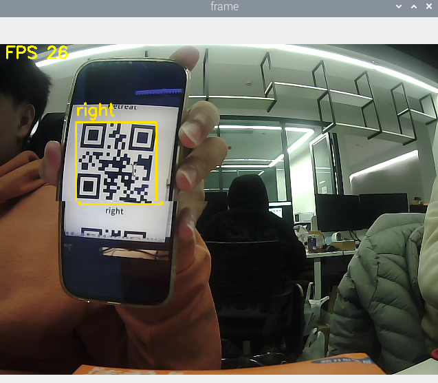
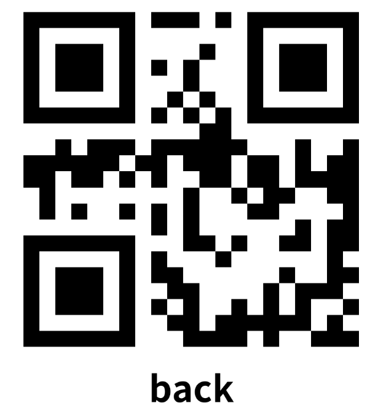
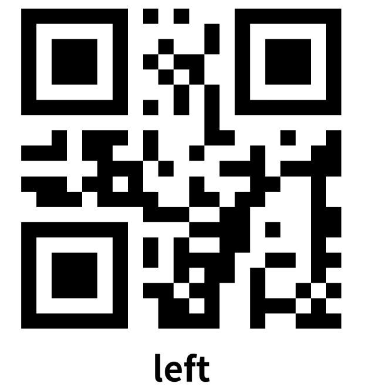
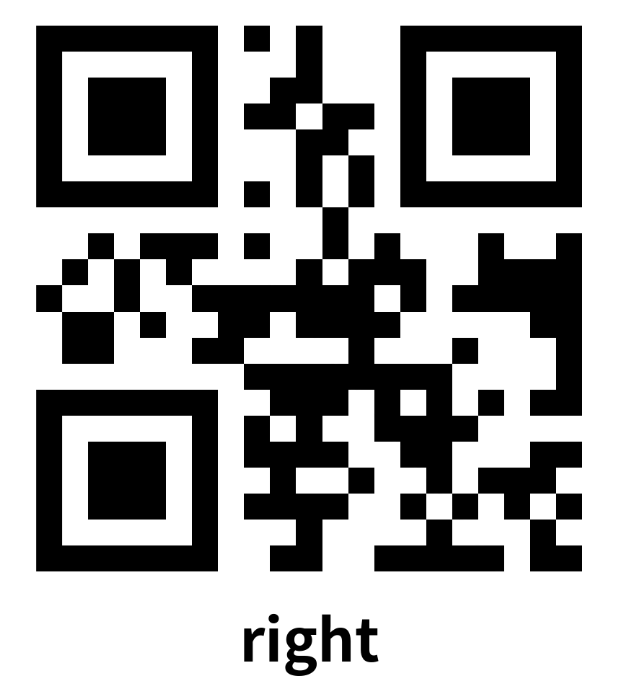
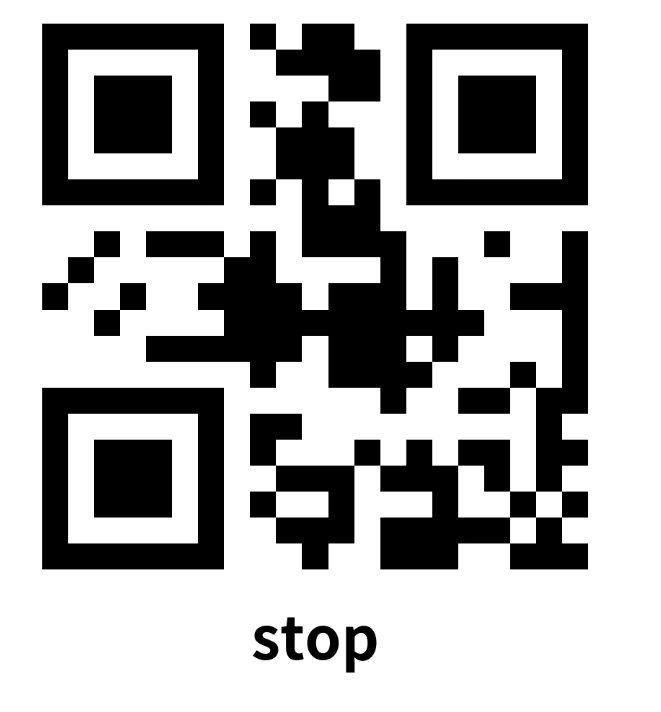
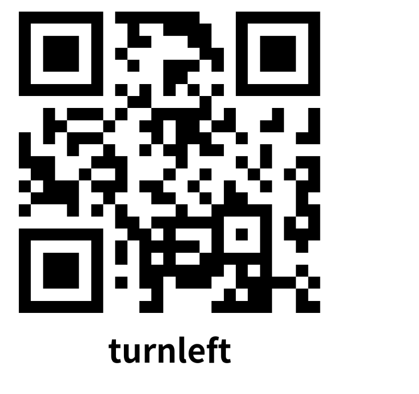
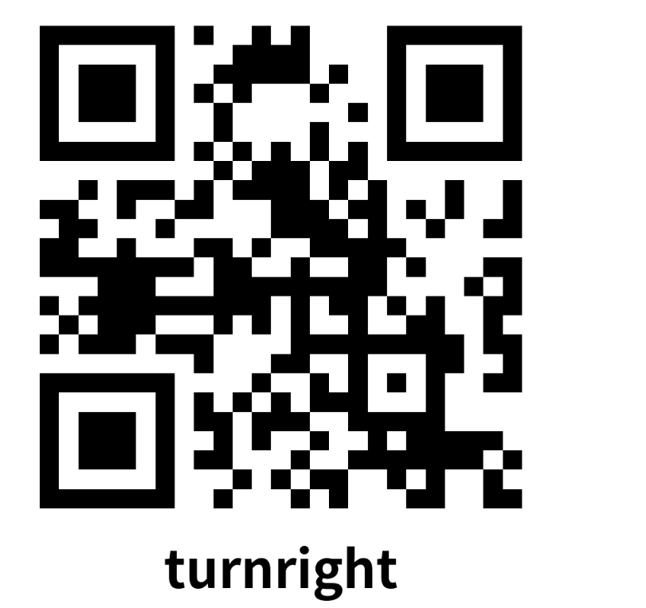

## 二维码运动控制

注：虚拟机、ROS-wifi图传模块需要与microROS控制板ROS_DOMAIN_ID需要一致，都要设置成20，可以查看【MicroROS控制板参数配置】来设置microROS控制板ROS_DOMAIN_ID，查看教程【连接MicroROS代理】判断ID是否一致。

### 1、玩法简介

本课程主要利用机器人的摄像头，获取摄像头的画面，识别二维码信息，根据二维码信息控制机器人运动。

### 2、程序代码参考路径

 该功能源码的位置位于，

```
/home/yahboom/yahboomcar_ws/src/yahboom_esp32ai_car/yahboom_esp32ai_car/qrTracker.py
```

### 3、程序启动

#### 3.1、启动命令

 终端输入，

```
ros2 run yahboom_esp32ai_car qrTracker 
```

**如果摄像头的角度不是处于该角度，请按CTRL+C结束程序，重新运行一下，这是因为网络延迟导致发送舵机的角度丢包导致**


**如果摄像头的画面图像出现倒置**，需要看**3.摄像头画面纠正(必看)**文档自己纠正，该实验不再阐述。


成功显示摄像头画面



开启识别二维码并执行指令。目前例程中能识别的二维码为QRCode，信息为"forward"表示前进，"back"表示后退，"left"表示左平移，"right"表示右平移，"stop"表示停止。"turnleft"表示左旋转，"turnright"表示右旋转，"stop"表示停止。



按q关闭摄像头。

### 4、核心代码

导入二维码解析库pybar

```py
import pyzbar.pyzbar as pyzbar
from PIL import Image
```

如果系统没有安装pybar，请打开终端运行以下命令安装。

出厂docker已经配置好环境，该步骤适合自己开发。

```
pip3 install pyzbar
sudo apt install libzbar-dev
```

解析灰度图像，提取图像中二维码的信息和图像位置。如果图像中没有二维码则信息为None。

```py
def detect_qrcode(image):
    # 转为灰度图像 Convert to grayscale image
    gray = cv2.cvtColor(image, cv2.COLOR_BGR2GRAY)
    barcodes = pyzbar.decode(gray)
    for barcode in barcodes:
        # 提取二维码的数据和边界框的位置 The data of the QR code and the position of the bounding box are extracted
        (x, y, w, h) = barcode.rect
        barcodeData = barcode.data.decode("utf-8")
        barcodeType = barcode.type
        # print("[INFO] Found {} barcode: {}".format(barcodeType, barcodeData))
        car_control(barcodeData)
        return barcodeData, (x, y, w, h)
    return None, (0, 0, 0, 0)
```

根据info的字符串命令控制机器人运动。

```py
def robot_action(self,data):
    if data == "forward":
       self.pub_vel(0.3,0.0,0.0)
    elif data == "back":
       self.pub_vel(-0.3,0.0,0.0)
    elif data == "left":
       self.pub_vel(0.0,0.0,1.0)
    elif data == "right":
       self.pub_vel(0.0,0.0,-1.0)
    elif data == "stop":
       self.pub_vel(0.0,0.0,0.0)
    elif data == "turnright":
       self.pub_vel(0.3,0.0,-0.5)
    elif data == "turnleft":
       self.pub_vel(0.3,0.0,0.5)
    elif data == "stop":
       self.pub_vel(0.0,0.0,0.0)

```

图像处理程序

```py
ret, frame = capture.read()
            action = cv2.waitKey(10) & 0xFF
            payload, (x, y, w, h) = QRdetect.detect_qrcode(frame.copy())
            if payload != None:
                cv2.rectangle(frame, (x, y), (x + w, y + h), (0, 225, 255), 2)
                cv2.putText(frame, payload, (x, y - 10), cv2.FONT_HERSHEY_SIMPLEX, 0.8, (0, 225, 255), 2)
                QRdetect.robot_action(payload)
            else:
                QRdetect.pub_vel(0.0,0.0,0.0)

```

### 附录（二维码图片）：

















