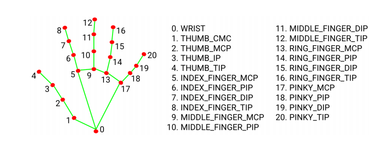
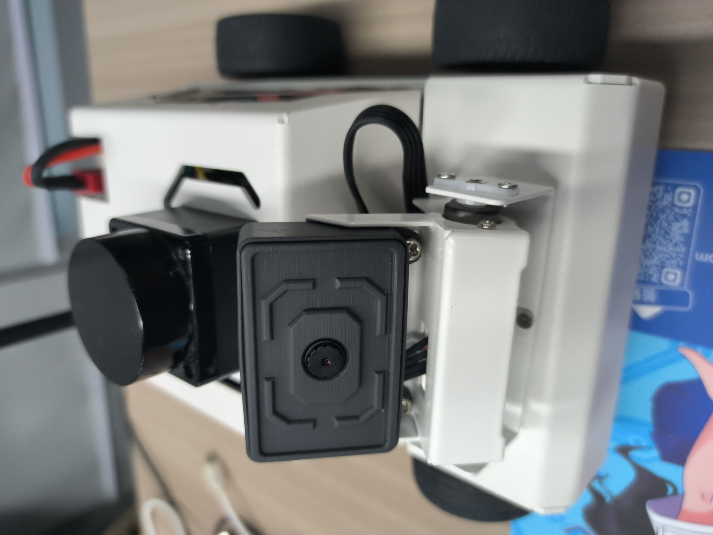
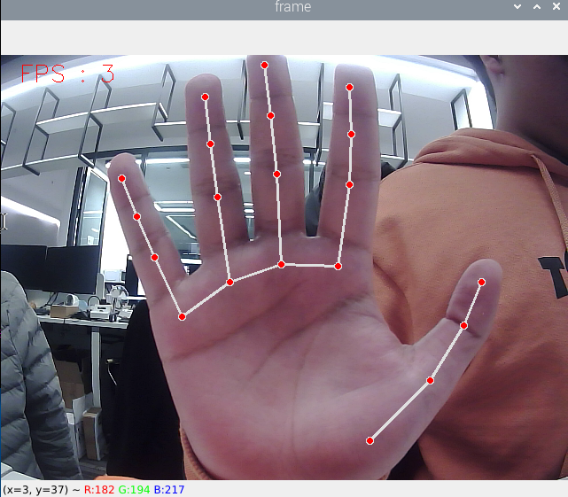
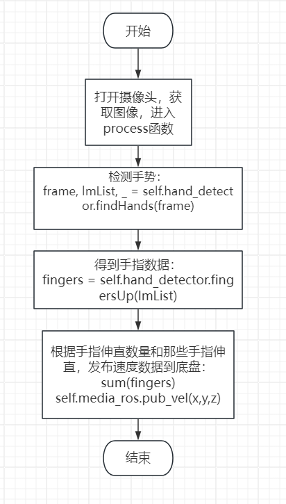

## 手势控制小车基础运动

注：虚拟机、ROS-wifi图传模块需要与microROS控制板ROS_DOMAIN_ID需要一致，都要设置成20，可以查看【MicroROS控制板参数配置】来设置microROS控制板ROS_DOMAIN_ID，查看教程【连接MicroROS代理】判断ID是否一致。

#### 1、程序功能说明

功能开启后，摄像头捕获图像，识别手势来控制小车移动。

| 手势 “5” | 小车前进 |
| -------- | -------- |
| 拳头     | 小车后退 |
| 手势 “1” | 小车向左 |
| 手势 “2” | 小车向右 |

**MediaPipe Hands从一帧中推断出21个手值关节的3D坐标**

****

### **2、程序代码参考路径**

** 该功能源码的位置位于，**

```
/home/yahboom/yahboomcar_ws/src/yahboom_esp32ai_car/yahboom_esp32ai_car/HandCtrl.py
```

### **3、程序启动**

#### **3.1、启动命令**

** 终端输入，**

```
ros2 run yahboom_esp32ai_car HandCtrl
```

**如果摄像头的角度不是处于该角度，请按CTRL+C结束程序，重新运行一下，这是因为网络延迟导致发送舵机的角度丢包导致**


**如果摄像头的画面图像出现倒置**，需要看**3.摄像头画面纠正(必看)**文档自己纠正，该实验不再阐述。


**开启该功能，然后把手放在摄像头前，画面会画出手指的形状，程序识别到手势后，就会把速度发给底盘，进而控制小车运动。**

****

### **4、核心代码**

#### **4.1、HandCtrl.py**

- **导入关键库**

  ```py
  from media_library import * #这个库包含了检测手部，获取手势等函数
  ```

- **获取手指数据**

  ```py
  frame, lmList, _ = self.hand_detector.findHands(frame)
  fingers = self.hand_detector.fingersUp(lmList)
  sum(fingers)
  fingers[]
  ```

  **可以看出首先检测到手，得到lmList的值，然后传入fingersUp函数。fingersUp函数是用来检测哪些手指是伸直的，伸直的手指的值为1，这里的具体代码也可以看media_library,py函数，里边有详细的解释，其实就是判断手指关节的xy值来判断时候伸直了。sum(fingers)函数是来计算伸直手指的数量，fingers[]可以用来枚举手指，比如说食指，咱们就是用fingers[1]来表示。**

- **发布速度到底盘**

  ```py
  self.media_ros.pub_vel(x,y,z)   #这函数也是在media_library,py中
  ```

#### **4.2、流程图**




