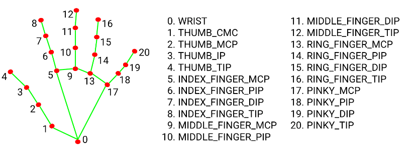
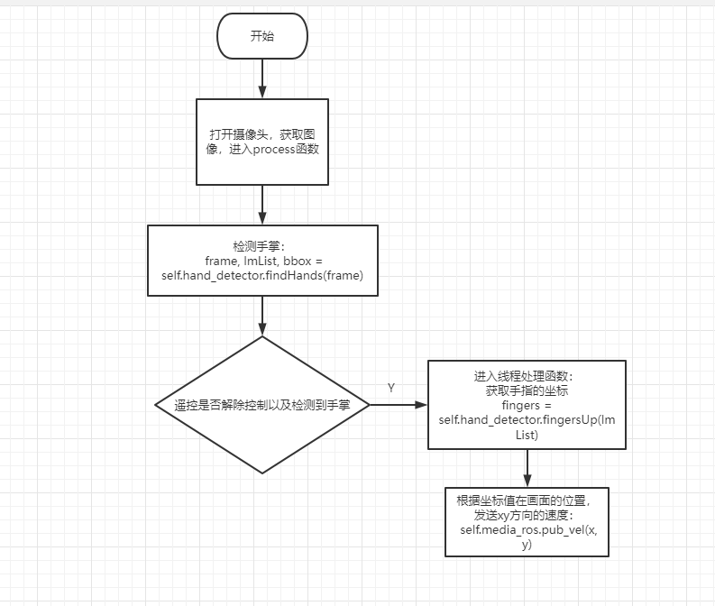
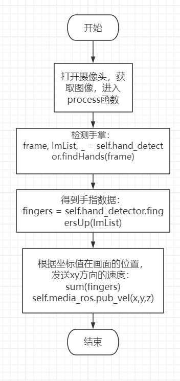
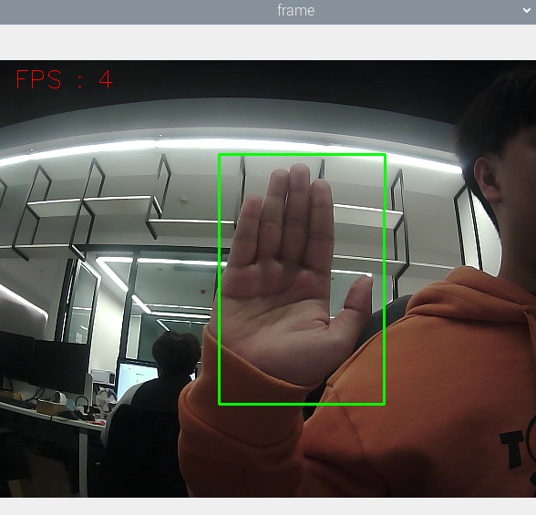
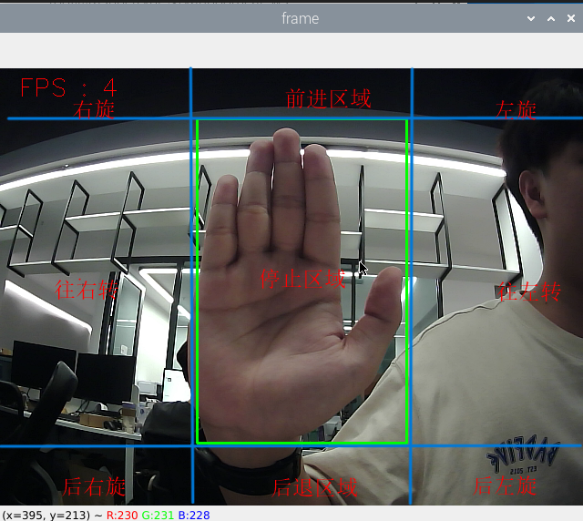

## 手掌控制小车运动

注：虚拟机、ROS-wifi图传模块需要与microROS控制板ROS_DOMAIN_ID需要一致，都要设置成20，可以查看【MicroROS控制板参数配置】来设置microROS控制板ROS_DOMAIN_ID，查看教程【连接MicroROS代理】判断ID是否一致。

#### 1、mediapipe简介

​	MediaPipe是一款由Google开发并开源的数据流处理机器学习应用开发框架。它是一个基于图的数据处理管线，用于构建使用了多种形式的数据源，如视频、音频、传感器数据以及任何时间序列数据。 MediaPipe是跨平台的，可以运行在嵌入式平台(树莓派等)，移动设备(iOS和Android)，工作站和服务器上，并支持移动端GPU加速。 MediaPipe为实时和流媒体提供跨平台、可定制的ML解决方案。

MediaPipe Hands是一款高保真的手和手指跟踪解决方案。它利用机器学习（ML）从一帧中推断出21个手的3D坐标。

在对整个图像进行手掌检测后，根据手部标记模型通过回归对检测到的手区域内的21个3D手关节坐标进行精确的关键点定位，即直接坐标预测。该模型学习一致的内部手姿势表示，甚至对部分可见的手和自我遮挡也具有鲁棒性。

为了获得地面真实数据，用了21个3D坐标手动注释了约30K幅真实世界的图像，如下所示（从图像深度图中获取Z值，如果每个对应坐标都有Z值）。为了更好地覆盖可能的手部姿势，并对手部几何体的性质提供额外的监督，还绘制了各种背景下的高质量合成手部模型，并将其映射到相应的3D坐标。



### 2、程序说明

本节案例在机器人主控上可能会运行速度很卡顿，可以识别到手掌之后先把小车架起来测试，这样效果会好一些。

小车会根据手掌在画面中的位置，控制底盘的运动。

手掌在画面上方->小车前进

手掌在画面下方->小车后退

手掌在画面左方->小车左移

手掌在画面下方->小车右移

#### 2.1、源码路径

 该功能源码的位置位于，

```
/home/yahboom/yahboomcar_ws/src/yahboom_esp32ai_car/yahboom_esp32ai_car/RobotCtrl.py
```

### 3、程序启动

#### 3.1、启动命令

 终端输入，

```
ros2 run yahboom_esp32ai_car RobotCtrl 
```

**如果摄像头的角度不是处于该角度，请按CTRL+C结束程序，重新运行一下，这是因为网络延迟导致发送舵机的角度丢包导致**


**如果摄像头的画面图像出现倒置**，需要看**3.摄像头画面纠正(必看)**文档自己纠正，该实验不再阐述。


开启该功能，然后把手放在摄像头前，画面会识别手掌，程序识别到手掌的位置后，就会把速度发给底盘，进而控制小车运动。



### 4、核心代码

##### 4.1、RobotCtrl.py

- 代码参考位置

  ```py
  /home/yahboom/yahboomcar_ws/src/yahboom_esp32ai_car/yahboom_esp32ai_car/RobotCtrl.py
  ```

- 代码分析

  1）、导入相对应的库文件

  ```py
  from media_library import *
  ```

  这个库文件主要是包括检测手掌、手指以及获取每个手指关节的坐标。

  2）、检测手掌，获取手指坐标

  ```py
  fingers = self.hand_detector.fingersUp(lmList)
  point_x = lmList[9][1]  #x值
  point_y = lmList[9][2]  #Y值
  ```

  结合1.简介的图片我们可以得知，其实获取到的就是咱们手掌**中指的第一个关节的坐标**，通过判断这个坐标在画面中的位置来发送给底盘xy方向上的速度，即可实现控制。

#### 4.2、流程图



#### 4.3、结果图




