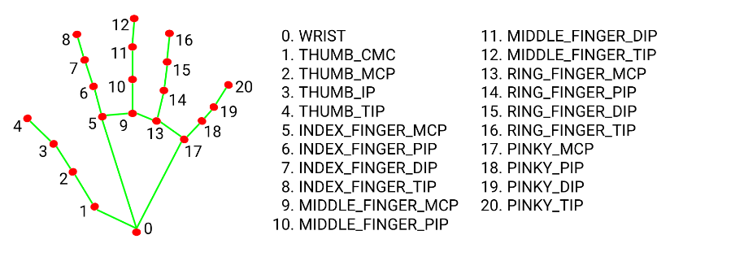
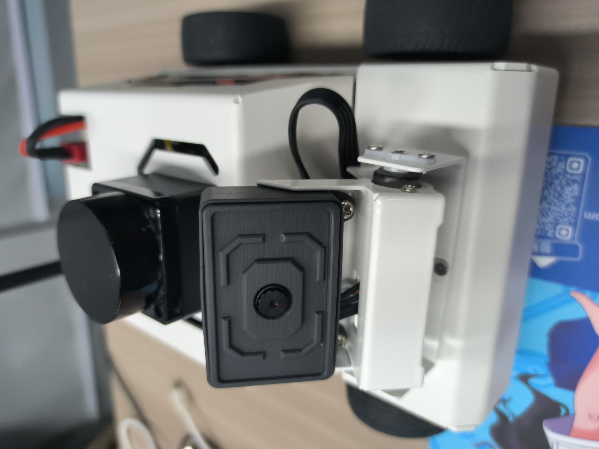
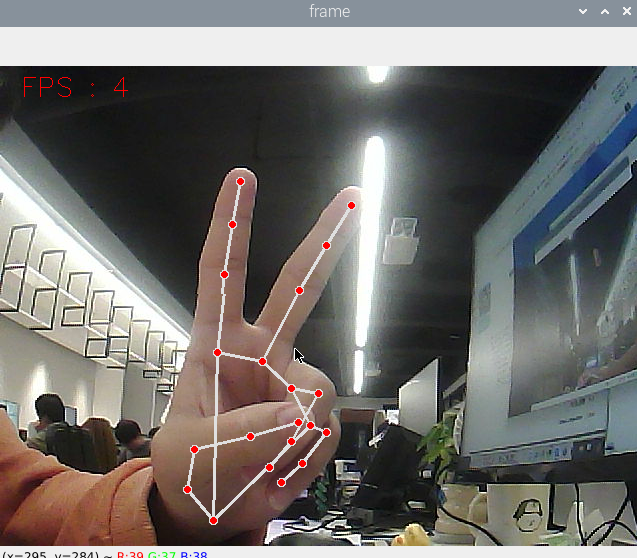
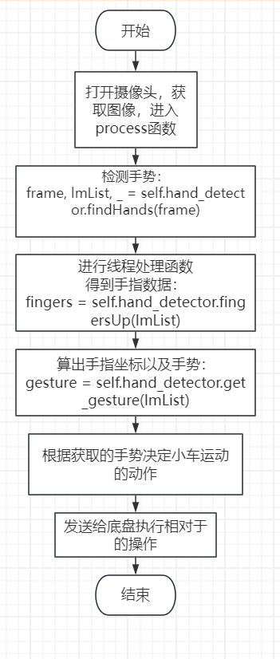

## 手势控制小车做形状

注：虚拟机、ROS-wifi图传模块需要与microROS控制板ROS_DOMAIN_ID需要一致，都要设置成20，可以查看【MicroROS控制板参数配置】来设置microROS控制板ROS_DOMAIN_ID，查看教程【连接MicroROS代理】判断ID是否一致。

#### 1、程序功能说明

功能开启后，摄像头捕获图像，识别相关手势来控制小车移动。

| 手势数字 “5”                                 | 小车停止         |
| -------------------------------------------- | ---------------- |
| 手势“yes”                                    | 小车走正方形     |
| 手势 “ok”                                    | 小车转圈         |
| 手势 “rock”（食指小拇指伸直，其他的弯曲）    | 小车走s型        |
| 手势鄙视（握紧拳头，伸出大拇指，大拇指朝下） | 小车往前之后往后 |

这里当每个手势运动完后，会归回初始化位置，并且滴一声，等待下次的手势识别。

MediaPipe Hands从一帧中推断出21个手值关节的3D坐标。



### 2、程序代码参考路径

 该功能源码的位置位于，

```
/home/yahboom/yahboomcar_ws/src/yahboom_esp32ai_car/yahboom_esp32ai_car/FingerCtrl.py
```

### 3、程序启动

#### 3.1、启动命令

 终端输入，

```
ros2 run yahboom_esp32ai_car FingerCtrl
```

**如果摄像头的角度不是处于该角度，请按CTRL+C结束程序，重新运行一下，这是因为网络延迟导致发送舵机的角度丢包导致**


**如果摄像头的画面图像出现倒置**，需要看**3.摄像头画面纠正(必看)**文档自己纠正，该实验不再阐述。


开启该功能，然后把手放在摄像头前，画面会画出手指的形状，程序识别到手势后，就会把速度发给底盘，进而控制小车运动。



### 4、核心代码

##### 4.1、 FingerCtrl.py

```py
frame, lmList, bbox = self.hand_detector.findHands(frame)   #检测手掌
fingers = self.hand_detector.fingersUp(lmList)  #获手指坐标
gesture = self.hand_detector.get_gesture(lmList)    #获取手势
以上三个函数的具体实现过程，可以参考media_library.py里的内容
```

这里的实现过程也是很简单，主函数打开摄像头获取数据后传入process函数，里边按照顺序依次进行“检测手掌”->"获手指坐标"->"获取手势"，然后根据手势结果来决定需要执行的动作。

#### 4.2、流程图




