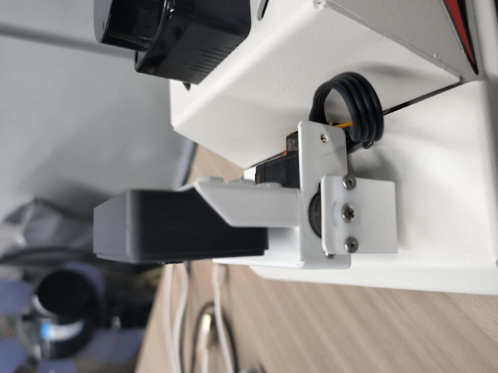
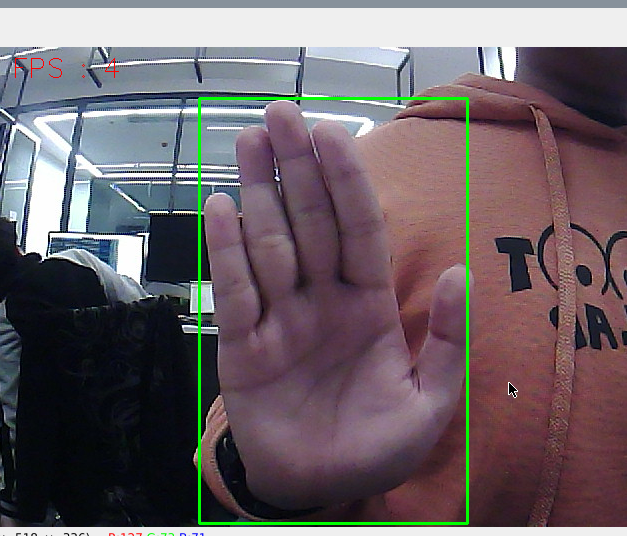
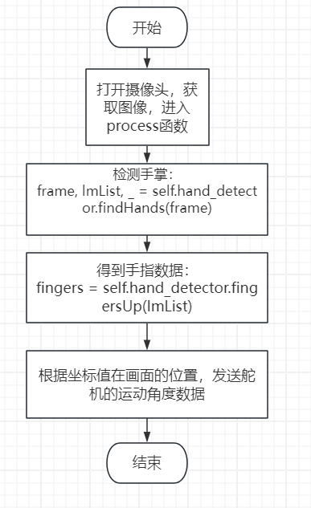

## 手掌控制二维云台舵机

注：虚拟机、ROS-wifi图传模块需要与microROS控制板ROS_DOMAIN_ID需要一致，都要设置成20，可以查看【MicroROS控制板参数配置】来设置microROS控制板ROS_DOMAIN_ID，查看教程【连接MicroROS代理】判断ID是否一致。

### 1、简介

MediaPipe是一款由Google开发并开源的数据流处理机器学习应用开发框架。它是一个基于图的数据处理管线，用于构建使用了多种形式的数据源，如视频、音频、传感器数据以及任何时间序列数据。MediaPipe是跨平台的，可以运行在嵌入式平台(树莓派等)，移动设备(iOS和Android)，工作站和服务器上，并支持移动端GPU加速。 MediaPipe为实时和流媒体提供跨平台、可定制的ML解决方案。

### 2、程序说明

程序启动后，摄像头捕获到图像后，小车二维云台会跟着手掌在画面中的运动。这里手掌运动的移动速度不要太快了，不然图像处理跟不上，会造成卡顿。

#### 2.1、程序代码参考路径

 该功能源码的位置位于，

```
/home/yahboom/yahboomcar_ws/src/yahboom_esp32ai_car/yahboom_esp32ai_car/control_shape.py
```

### 3、程序启动

#### 3.1、启动命令

 终端输入，

```
ros2 run yahboom_esp32ai_car control_shape 
```

**如果摄像头的角度不是处于该角度，请按CTRL+C结束程序，重新运行一下，这是因为网络延迟导致发送舵机的角度丢包导致**


**如果摄像头的画面图像出现倒置**，需要看**3.摄像头画面纠正(必看)**文档自己纠正，该实验不再阐述。

功能开启后，小车二维云台会跟随手掌运动。



### 4、代码解析

#### 4.1、control_shape.py

- 代码参考位置

  ```
  /home/yahboom/yahboomcar_ws/src/yahboom_esp32ai_car/yahboom_esp32ai_car/control_shape.py
  ```

- 代码分析

  1）、导入重要的库文件

  ```py
  from media_library import *
  ```

  2）、检测手部，获取手指信息

  ```py
  frame, lmList, bbox = self.hand_detector.findHands(frame)
  #bbox是框住检测到的手部的画框的xy的最小和最大值，这个值很重要，通过计算中心坐标，可以判断手掌在画面的位置，源码在media_library.py中
  angle = self.hand_detector.ThumbTOforefinger(lmList)
  #这里可以计算出大拇指的弯曲角度来控制夹爪的张合度
  ```

  3）、计算各个舵机的角度

  ```py
  point_x = lmList[9][1]
  point_y = lmList[9][2]
  if point_y >= 200: self.y -= 1
  elif point_y <= 100: self.y += 1

  if point_x >= 420: self.x -= 1
  elif point_x <= 300: self.x += 1
  
  if self.x <= -45: self.x = -45
  elif self.x >= 45: self.x=45
  if self.y <= -90: self.y = -90
  elif self.y >=40: self.y = 40
  ```
  
  可以看出，indexX和indexY为画框的中心点坐标，通过判断，计算出舵机应该转动的角度，每个角度计算的方式的参数是根据实际可以转动的角度和摄像头的可视范围标定的。

#### 4.2、流程图




